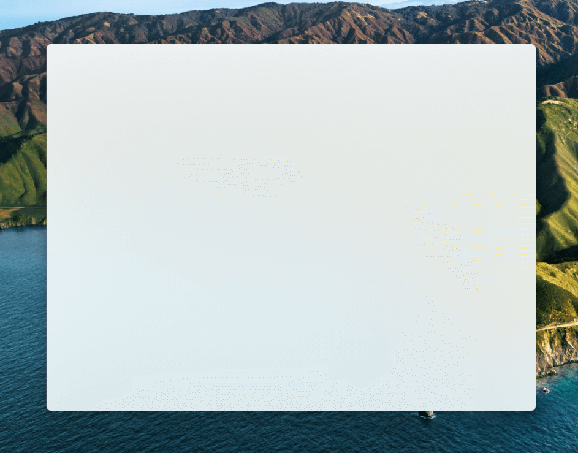
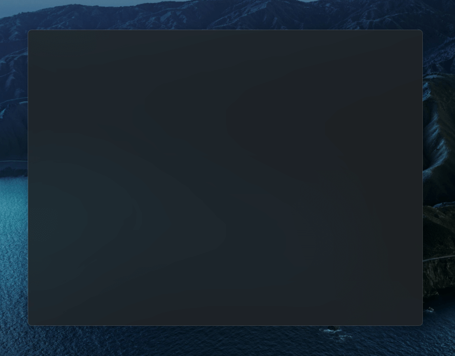

# Electron Mica

  

This is a demo project of Mica material in an Electron app.

## Develop

Follow the steps:

```sh
# install dependencies.
yarn install

# this will download [an executable](https://github.com/sindresorhus/win-wallpaper) to get current wallpaper.
yarn download-bin

# launch the app
yarn start
```

## Screenshots




